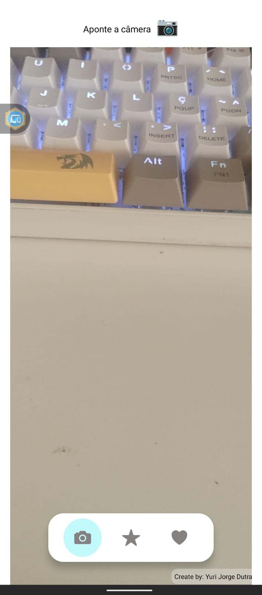

# QR Code Reader - Leitor de QR Codes 📱

[](https://expo.dev/)
[](https://reactnative.dev/)
[](https://www.typescriptlang.org/)
[](LICENSE)

## 📋 Visão Geral

Aplicativo mobile multiplataforma desenvolvido com **React Native** e **Expo** que permite a leitura de QR Codes através da câmera do dispositivo. O app captura e armazena informações (links, textos, dados) de forma local e organizada, oferecendo uma interface intuitiva para gerenciar favoritos salvos.

### 🎯 Características Principais

- **Leitura em Tempo Real**: Captura instantânea de QR Codes através da câmera
- **Armazenamento Local**: Persistência de dados usando AsyncStorage
- **Gerenciamento de Favoritos**: Interface completa para salvar, visualizar e remover links/textos
- **Navegação Intuitiva**: Sistema de abas para alternar entre câmera e favoritos
- **Suporte Multiplataforma**: Funciona em iOS, Android e Web

## 🚀 Funcionalidades

### 📷 Leitura de QR Codes
- Captura automática de QR Codes em tempo real
- Detecção instantânea ao apontar a câmera
- Suporte para links (URLs) e textos em geral
- Visualização do conteúdo lido antes de salvar

### ⭐ Sistema de Favoritos
- Salvar links e textos com nome personalizado
- Lista organizada com data de criação
- Abertura direta de links salvos
- Remoção individual de favoritos
- Persistência de dados mesmo após fechar o app

### 🎨 Interface do Usuário
- Design moderno e responsivo
- Navegação por abas na parte inferior
- Modal para adicionar favoritos
- Feedback visual para ações do usuário

## 📸 Capturas de Tela

<div style="display: flex; flex-direction: column; gap: 20px; align-items: center;">

### Tela de Leitura de QR Code


### Adicionar Favorito


### Lista de Favoritos


</div>

## 🛠️ Stack Tecnológico

### Core
- **React Native** `0.74.5` - Framework para desenvolvimento mobile multiplataforma
- **React** `18.2.0` - Biblioteca JavaScript para construção de interfaces
- **TypeScript** `~5.3.3` - Superset JavaScript com tipagem estática
- **Expo SDK** `~51.0.28` - Plataforma e conjunto de ferramentas para React Native

### Bibliotecas Principais
- **expo-camera** `~15.0.14` - Integração com câmera do dispositivo e leitura de QR Codes
- **@react-native-async-storage/async-storage** `1.23.1` - Armazenamento local assíncrono
- **expo-status-bar** `~1.12.1` - Controle da barra de status do sistema
- **@expo/vector-icons** `^14.0.2` - Ícones vetoriais (Ionicons)
- **react-native-reanimated** `~3.10.1` - Animações performáticas nativas

### Ferramentas de Desenvolvimento
- **@babel/core** `^7.20.0` - Transpilador JavaScript
- **@types/react** `~18.2.45` - Tipos TypeScript para React

## 📁 Estrutura do Projeto

```
QrRaderFinksV2/
├── App.tsx                      # Componente principal e navegação
├── app.json                     # Configurações do Expo
├── package.json                 # Dependências do projeto
├── tsconfig.json                # Configurações TypeScript
├── assets/                      # Recursos visuais
│   ├── screenShots/            # Capturas de tela
│   │   ├── can.jpeg
│   │   ├── add fav.jpeg
│   │   └── fav list.jpeg
│   ├── icon.png
│   └── splash.png
└── src/
    └── pages/
        ├── cameraScreen.tsx     # Tela de câmera (não utilizada no App principal)
        ├── favoriteScreen.tsx   # Tela de favoritos
        └── components/
            ├── helloWave.tsx
            └── parallaxScrollView.tsx
```

## 🏗️ Arquitetura

### Componentes Principais

**App.tsx** - Componente raiz que gerencia:
- Estado de navegação entre abas (Câmera/Favoritos)
- Permissões de câmera
- Leitura de QR Codes
- Modal para adicionar favoritos
- Integração com AsyncStorage

**FavoriteScreen.tsx** - Tela de gerenciamento:
- Carregamento de favoritos do AsyncStorage
- Renderização da lista de favoritos
- Funções de deletar e abrir links
- Integração com Linking API para abrir URLs

### Fluxo de Dados

1. **Leitura de QR Code**:
   ```
   CameraView → handleBarcodeScanned → setScannedLink → Exibição do resultado
   ```

2. **Salvar Favorito**:
   ```
   Modal → Input nome → handleSaveFavorite → AsyncStorage.setItem → Atualização da lista
   ```

3. **Carregar Favoritos**:
   ```
   FavoriteScreen mount → loadFavorites → AsyncStorage.getItem → setFavorites
   ```

## 🚀 Como Executar o Projeto

### Pré-requisitos

- Node.js (versão 16 ou superior)
- npm ou yarn
- Expo CLI instalado globalmente ou npx
- Dispositivo móvel com Expo Go ou emulador/simulador

### Instalação

1. **Clone o repositório**:
```bash
git clone https://github.com/seu-usuario/QrRaderFinksV2.git
cd QrRaderFinksV2
```

2. **Instale as dependências**:
```bash
npm install
# ou
yarn install
```

3. **Inicie o servidor de desenvolvimento**:
```bash
npm start
# ou
npx expo start
```

4. **Execute em plataforma específica**:
```bash
# Android
npm run android

# iOS
npm run ios

# Web
npm run web
```

### Executando no Dispositivo Físico

1. Instale o app **Expo Go** na App Store ou Google Play
2. Execute `npm start` no terminal
3. Escaneie o QR Code exibido no terminal com:
   - **iOS**: Câmera nativa
   - **Android**: App Expo Go

## 💻 Como Usar

1. **Permitir acesso à câmera**: Na primeira execução, conceda permissão de câmera
2. **Ler QR Code**: Aponte a câmera para um QR Code
3. **Visualizar resultado**: O conteúdo lido aparecerá abaixo da câmera
4. **Salvar favorito**: Clique no ícone ⭐ e digite um nome personalizado
5. **Gerenciar favoritos**: Acesse a aba de favoritos para visualizar, abrir ou remover itens salvos

## 🔧 Configurações e Personalização

### Permissões Necessárias

O app requer as seguintes permissões:

- **Câmera**: Para leitura de QR Codes
- **Armazenamento**: Para salvar favoritos localmente (AsyncStorage)

### Armazenamento de Dados

Os favoritos são armazenados localmente usando `AsyncStorage` com a chave `"favorites"`. O formato dos dados:

```typescript
interface Favorite {
  name: string;      // Nome personalizado
  link: string;      // Conteúdo do QR Code (link ou texto)
  date: string;      // Data de criação
}
```

## 📱 Compatibilidade

- ✅ **iOS**: Suporta iOS 13.0 e superior
- ✅ **Android**: Suporta Android 6.0 (API 23) e superior
- ✅ **Web**: Compatível com navegadores modernos (requer permissão de câmera)

## 🎨 Recursos de Design

- Interface moderna com cores suaves
- Navegação intuitiva por abas
- Feedback visual em todas as interações
- Modais para confirmação de ações
- Layout responsivo adaptável a diferentes tamanhos de tela

## 🔮 Melhorias Futuras

- [ ] Suporte para múltiplos tipos de códigos de barras
- [ ] Histórico de QR Codes escaneados
- [ ] Compartilhamento de favoritos
- [ ] Exportação/importação de favoritos
- [ ] Categorização de favoritos
- [ ] Busca na lista de favoritos
- [ ] Modo escuro
- [ ] Sincronização com nuvem

## 🤝 Contribuindo

Contribuições são bem-vindas! Sinta-se à vontade para:

1. Fazer fork do projeto
2. Criar uma branch para sua feature (`git checkout -b feature/AmazingFeature`)
3. Commit suas mudanças (`git commit -m 'Add some AmazingFeature'`)
4. Push para a branch (`git push origin feature/AmazingFeature`)
5. Abrir um Pull Request

## 📄 Licença

Este projeto está licenciado sob a Licença MIT. Veja o arquivo [LICENSE](./LICENSE) para mais detalhes.

## 👨‍💻 Desenvolvedor

**Yuri Jorge Dutra**

Desenvolvido com ❤️ utilizando React Native e Expo.

---

⭐ Se este projeto foi útil para você, considere dar uma estrela no repositório!
